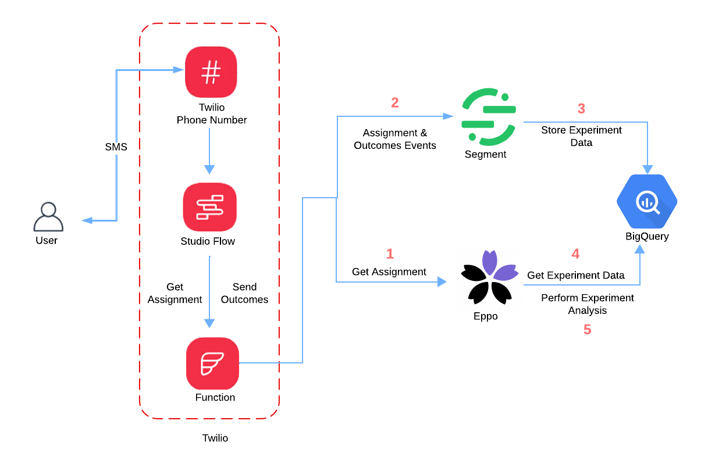

# A/B Testing Twilio with Eppo

This code is part of a tutorial which teaches you to A/B test SMS messages sent to remind users of upcoming appointments. The goal is to determine whether a change in the message could bolster user's rate of response. 

The key components of this solution are shown below.

- A Twilio Phone Number lets you send and receive messages.
- Studio Flow is a drag-and-drop tool to build voice and messaging applications and will be included in your Twilio account. 
- Twilio Functions is a serverless environment to host your code and is also included in your Twilio account.
- Eppo is a warehouse-native A/B experimentation software. 
- Segment is a Customer Data Platform tool that can collect data and send it to a data warehouse.
- BigQuery is an enterprise data warehouse. 

A link to the tutorial will be added soon. 

